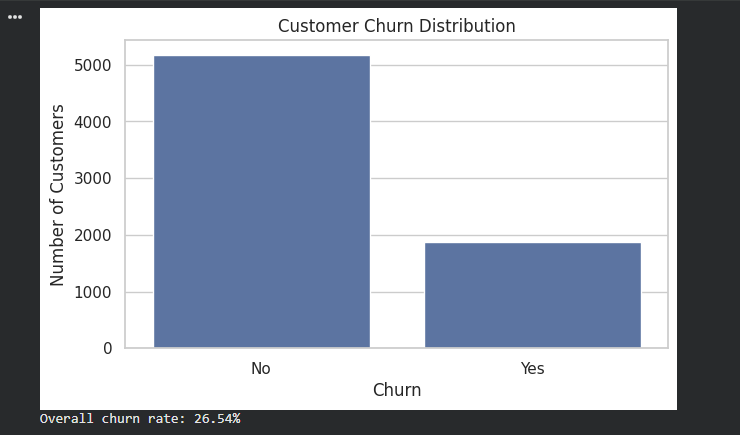
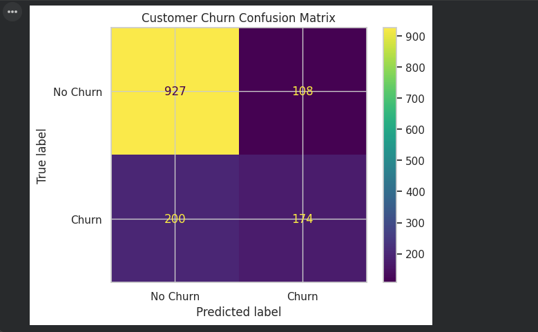
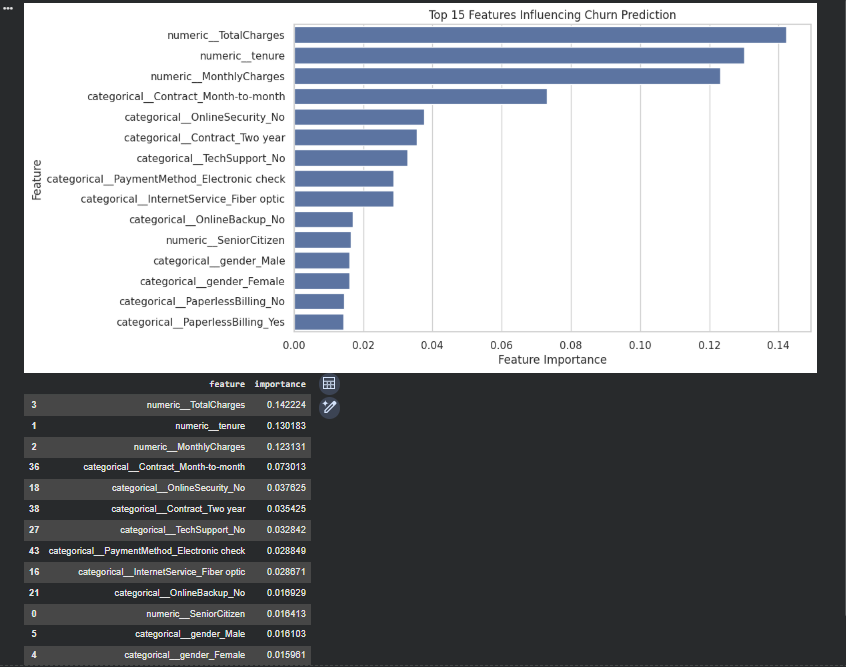

# Customer Churn Analysis & Prediction

An end-to-end Python project that analyzes telecom customer churn and builds a Random Forest classification model to predict customers at risk of leaving.

## Project Overview

Customer churn can directly affect recurring revenue and customer lifetime value. This project explores customer demographics, services, contracts, tenure, and billing behavior to identify churn patterns and build a predictive model.

### Objectives

- Perform exploratory data analysis (EDA)
- Identify customer segments associated with churn
- Clean and preprocess numerical and categorical data
- Build a Random Forest classification model
- Evaluate the model using accuracy, precision, recall, F1-score, ROC-AUC, and a confusion matrix
- Identify important features for churn prediction
- Translate analytical findings into practical customer-retention considerations
## Technologies Used

- Python
- Pandas
- NumPy
- Matplotlib
- Seaborn
- Scikit-learn
- Jupyter Notebook

## Project Structure

```text
customer_churn_analysis_prediction/
│
├── data/
├── Customer_Churn_Analysis_Prediction.ipynb
├── customer_churn_analysis_prediction.py
├── churn_distribution.png
├── confusion_matrix.png
├── feature_importance.png
├── requirements.txt
└── README.md
```

## Project Workflow

1. Load and inspect the Telco Customer Churn dataset
2. Analyze customer churn distribution
3. Handle missing and incorrect values
4. Encode categorical variables
5. Split data into training and testing sets
6. Apply feature scaling using StandardScaler
7. Train a Random Forest Classifier
8. Evaluate model performance using accuracy and a confusion matrix

## Model Results & Key Findings

The Random Forest classification model was evaluated on a held-out test set of 1,409 customers.

### Model Performance

| Metric | Result |
|---|---:|
| Accuracy | 78.1% |
| ROC-AUC | 0.822 |
| Churn Precision | 0.62 |
| Churn Recall | 0.47 |
| Churn F1-Score | 0.53 |

The overall customer churn rate in the dataset was **26.54%**.

## Visual Analysis

### Customer Churn Distribution

The dataset shows an overall customer churn rate of **26.54%**, indicating that approximately one in four customers has churned.



---

### Model Evaluation — Confusion Matrix

The model correctly identified **174 of 374 actual churn customers** in the test set.



---

### Feature Importance

The Random Forest model identified the following variables among the most influential predictors of customer churn:

- Total Charges
- Tenure
- Monthly Charges
- Month-to-month Contract
- Online Security
- Two-year Contract
- Tech Support
- Electronic Check Payment Method



### Model Evaluation

The Random Forest model achieved:

- **Accuracy:** 78.1%
- **ROC-AUC:** 0.822
- **Churn Precision:** 0.62
- **Churn Recall:** 0.47
- **Churn F1-Score:** 0.53

### Confusion Matrix

The model correctly identified **174 of 374 actual churn customers** in the test set.

### Feature Importance

The most influential predictive features included:

1. Total Charges
2. Tenure
3. Monthly Charges
4. Month-to-month Contract
5. Online Security
6. Two-year Contract
7. Tech Support
8. Electronic Check Payment Method

### Confusion Matrix

The model produced the following results on the test set:

- **927** customers correctly classified as No Churn
- **108** customers incorrectly classified as Churn
- **200** churn customers incorrectly classified as No Churn
- **174** customers correctly identified as Churn

### Key Features Influencing Predictions

The top model features included:

1. Total Charges
2. Tenure
3. Monthly Charges
4. Month-to-month Contract
5. Online Security
6. Two-year Contract
7. Tech Support
8. Electronic Check Payment Method
9. Fiber Optic Internet Service
10. Online Backup

These feature-importance results indicate which variables contributed most to the model's predictions. They should not be interpreted as causal relationships.

## Business Insights

The analysis suggests several areas that could be investigated for customer-retention strategies:

- Prioritize customers on month-to-month contracts for retention initiatives.
- Monitor customers with relatively high monthly charges.
- Pay attention to early-tenure customers during onboarding and service-quality initiatives.
- Investigate service combinations associated with higher predicted churn risk.
- Use predicted churn probabilities to prioritize limited retention resources.

These are analytical hypotheses rather than causal conclusions and should be validated through further business testing.

## Model Performance

- **Algorithm:** Random Forest Classifier
- **Reported Accuracy:** 78%
- **Evaluation:** Accuracy Score and Confusion Matrix

## Business Insight

Customer churn can directly impact recurring revenue and customer lifetime value. 
Analyzing customer characteristics, service usage, contracts, tenure, and billing 
behavior can help businesses identify customers who may be at higher risk of leaving 
and support proactive retention strategies.

## Dataset

**Telco Customer Churn** dataset.

The notebook loads the public dataset from IBM's archived sample repository at runtime, so the raw dataset is intentionally not included in this repository.

- Dataset size: approximately 7,000 customers
- Target: `Churn`
- Key variables include tenure, contract type, internet service, payment method, monthly charges, and total charges.

Dataset reference:
https://github.com/IBM/telco-customer-churn-on-icp4d

## Tech Stack

- Python
- Pandas
- NumPy
- Matplotlib
- Seaborn
- Scikit-learn
- Jupyter Notebook

## Machine Learning Workflow

1. Load the Telco customer dataset
2. Inspect data types, missing values, and duplicates
3. Convert `TotalCharges` to numeric
4. Explore churn distribution and major customer segments
5. Separate predictors and target
6. Apply preprocessing using a Scikit-learn pipeline
7. Train/test split with stratification
8. Train a Random Forest classifier
9. Evaluate classification performance
10. Analyze feature importance
11. Translate findings into business-oriented retention hypotheses

## How to Run

### Option 1 — Google Colab

Open `customer_churn_analysis_prediction.ipynb` in Google Colab and run the cells sequentially.

### Option 2 — Local Python Environment

```bash
pip install -r requirements.txt
jupyter notebook customer_churn_analysis_prediction.ipynb
```

The notebook downloads the dataset from the public IBM GitHub source when executed.

## Repository Structure

```text
customer_churn_analysis_prediction/
│
├── customer_churn_analysis_prediction.ipynb
├── README.md
├── requirements.txt
├── .gitignore
└── data/
    └── README.md
```

## Portfolio Value

This project demonstrates practical skills in:

- Data cleaning
- Exploratory data analysis
- Data visualization
- Feature preprocessing
- Supervised machine learning
- Classification model evaluation
- Feature importance analysis
- Business interpretation of analytical results

## Attribution

The project topic and dataset workflow were informed by the **Customer Churn Analysis Prediction** tutorial from GeeksforGeeks and the IBM Telco Customer Churn sample dataset. The notebook in this repository is an independently structured implementation with its own preprocessing pipeline, evaluation workflow, and business interpretation.

## Future Enhancements

- Compare Logistic Regression, Decision Tree, Random Forest and Gradient Boosting
- Hyperparameter tuning using GridSearchCV/RandomizedSearchCV
- Threshold optimization for recall-focused retention campaigns
- SHAP model explainability
- Interactive Streamlit dashboard
- Customer-level churn-risk scoring
